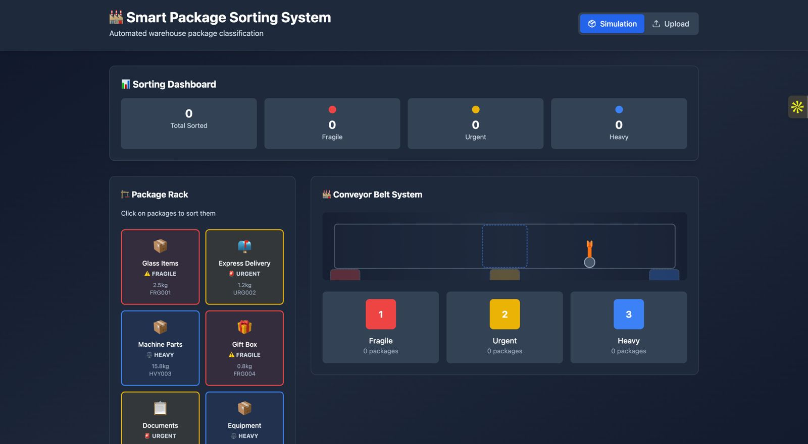

# 📦 Smart Package Sorting System

An intelligent, animated system for sorting packages using AI and a simulated conveyor belt with a robotic arm. Built with **FastAPI**, **AWS Rekognition**, **LLM classification**, and a beautiful **React + Tailwind** frontend.

## 🌐 Live Demo
- **Interact with my robot**: [Live app](https://smart-robotic-package-sorter.up.railway.app/)  

---

## Features

✅ Upload package images or simulate them  
✅ Smart label detection using AWS Rekognition  
✅ LLM-based fallback for semantic classification  
✅ Real-time robotic arm animation with bin sorting  
✅ Confidence scores and labeled package previews  
✅ Seamless integration with FastAPI backend  
✅ Fully deployed on **Railway** 

---

## 🖼️ Screenshots

| Simulation | Upload | 
|------------|--------|
|  |  |

---

## 🧠 System Architecture

User
  
│
       
Frontend: React + Vite
    
│
       
Upload / Simulate Packages

│

[FastAPI Backend]

│

┌─────┬──────┐

│      Rekognition     │    LLM Fallback   │

└─────┴──────┘

│

Classify + Annotate

│

Return Label + Bin + URL

│

Animate Sorting Mechanism


---

## 🧰 Tech Stack

### Frontend
- ⚛️ React (Vite)
- 🎨 Tailwind CSS
- 🎞️ Framer Motion (optional for animations)

### Backend
- ⚡ FastAPI
- 🧠 AWS Rekognition
- 🧠 OpenAI or custom LLM classification
- 🐘 Railway (deployment)

---

## ⚙️ Setup Instructions

### 1. Clone the Repo

```bash
git clone https://github.com/HonraoYash/Smart-Package-Sorter.git
cd Smart-Package-Sorter


### 2. Backend Setup (FastAPI)
cd smart-sorter-backend
python -m venv venv
source venv/bin/activate
pip install -r requirements.txt

# Run the server
uvicorn main:app --reload
Make sure you set your AWS credentials and region using environment variables or AWS CLI.

### 3. Frontend Setup (Vite + React)
cd smart-sorter-frontend
npm install

# Create `.env` file
echo "VITE_BACKEND_URL=https://your-backend-url.railway.app" > .env

# Run frontend
npm run dev

### 4. Deployment
Deployed using Railway:

Backend: Dockerized with exposed /static route

Frontend: Uses Vite build + public API URL from .env.production

⭐️ Show Your Support
If you liked this project:

🌟 Star the repo

🍴 Fork it

🧠 Try improving the robotic arm logic!
